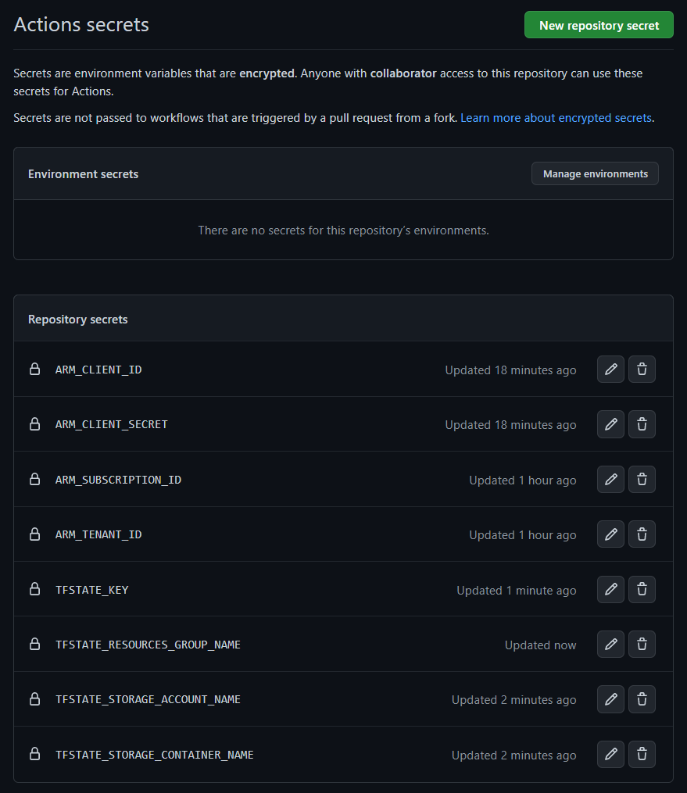

<!-- ABOUT THE PROJECT -->
# Azure Entity Search

Azure Entity Search provides multiple reference implementations for performing entity search on Azure.

## Contents

The asset consists of the following artifacts

* Infrastructure - terraform scripts for deploying the asset using IaC [](/terraform)
* Application - azure function used to query the search infrastructure [](/app)

## Core Prerequisites

The following secrets must be added to the pipeline. Documentation for adding secrets specific to azure and github actions can be found [here](https://registry.terraform.io/providers/hashicorp/azurerm/latest/docs/guides/service_principal_client_secret)

Make sure to set the scope of the permissions to the subscription. 



### Create Secrets in the GitHub UI

Follow the documentation here to create the secrets above: https://docs.github.com/en/actions/security-guides/encrypted-secrets#creating-encrypted-secrets-for-a-repository

## Installation

Installation is executed through github pipelines. 

* [bootstrap](.github/workflows/bootstrap-infrastructure.yml)
* [validate](.github/workflows/validate-infrastructure.yml)
* [deploy](.github/workflows/deploy-infrastructure.yml)

Terraform is used within the pipelines and requires bootstrapping in the azure environment before the validate and deploy pipelines can be used. 

> bootstrap

```bash
# modify variables in the terraform/bootstrap/terraform.tfvars to change, for example, the resource prefix
vi terraform/bootstrap/terraform.tfvars

# update the repository so the github action can see the updates
git add -A
git commit -m"updated resource prefix"
git push origin main

# this is run from the repository root
gh workflow run .github/workflows/bootstrap-infrastructure.yml
```

After bootstrap has completed, the job will create a storage account in a resource group. You can find the resource group and storage account name in the log output for the bootstrap job run. 

Open the storage account name in the azure portal and set the TFSTATE_* environment variables to the following:

| Secret | Value to Use |
|---|---|
| TFSTATE_STORAGE_ACCOUNT_NAME | the storage account name created during the bootstrap job run | 
| TFSTATE_STORAGE_CONTAINER_NAME| 'tfstate' |
| TFSTATE_KEY | the key in the storage account 'access keys' section |
| TFSTATE_RESOURCES_GROUP_NAME | the name of the resource group created during the bootstrap job run |

> validate and deploy

```bash
# (optional) modify variables in the terraform/bootstrap/terraform.tfvars to change, for example, the resource prefix
vi terraform/terraform.tfvars
git add -A
git commit -m"updated resource prefix"
git push origin main

# manually validate the infrastructure
gh workflow run .github/workflows/validate-infrastructure.yml

# manually deploy the infrastructure
gh workflow run .github/workflows/deploy-infrastructure.yml
```

## Addons

## Security

## Testing

## Retail Materials

## Architecture


## Solution Components

### Trademarks

Trademarks This project may contain trademarks or logos for projects, products, or services. Authorized use of Microsoft trademarks or logos is subject to and must follow Microsoft’s Trademark & Brand Guidelines. Use of Microsoft trademarks or logos in modified versions of this project must not cause confusion or imply Microsoft sponsorship. Any use of third-party trademarks or logos are subject to those third-party’s policies.
