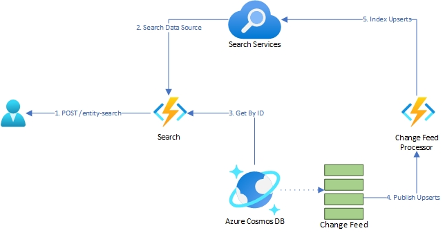

<!-- ABOUT THE PROJECT -->
# Azure Entity Search

Implementation for Azure Cognitive Search for fast, efficient, and intelligent searching. Click [here](https://learn.microsoft.com/en-us/azure/search/search-what-is-azure-search) to learn more.

## Contents

The asset consists of the following artifacts

* Infrastructure - terraform scripts for deploying the asset using IaC [](/infrastructure/terraform)
* Application - azure functions used to query the search infrastructure and index new content [](/src/ap)
* Sample Search Resources - Sample data and accompanying definitions for index, indexer, and datasource [](data/search-demo/)
* Scripts - Powershell script for populating cosmos DB with sample data
  
## Core Prerequisites

* Active Azure subscription
* Serice Principal with Contributor access
* Azure CLI
* Azure Functions Core Tools
* Terraform CLI

### Deployment via Powershell Script

In the [scripts](/scripts/) folder is a powershell setup script, [setup.ps1](/scripts/setup.ps1), that you can use to deploy all the required resources to run your own instance of entity search.  The script creates infrastructure using terraform and will use a local state file. If you need to use a remote state file you can modify the script to configure your backend.

For the script to work you must supply a Terraform variables (`tfvars`) file. The following variables are used:

* `uniqefy`* - Append random string of 5 alpha-characters to specific resources to ensure global uniquness
* `location`
* `resource_group_name`*
* `appstate_sa_name`* - Name of Azure Storage Account for function states to deploy
* `search_function_name`*
* `change_feed_function_name`*
* `cosmos_account_name`
* `database_name`
* `container_name`
* `partition_key_path` - Partition key for Azure Search connected Comsmos DB container. Ex: /id
* `search_service_name`
* `index_definition_file` - Index definition file to be used by Search service. This file declares all the indexed fieds of your data
* `datasource_definition_file` - Data source definition file to be used by Search service. This includes connection and container detals
* `indexer_definition_file` - Indexer definition for crawling and indexing data in your data source. Indexer description must use the defined indexes from your index file

> `*` - Optional varaibles with a default value set

Setup is prompt guide in the following order:

* Deploy infrastructure
* Deploy Change Feed Function
* Deploy Search API Function
* Load Sample Data

The setup will initialize the following resources:

* Resource Group
* Storage Account
* Search API
  * Azure App. Service Plan
  * Azure Function App
  * Azure App. Insights
* Change Feed Processor
  * Azure App. Service Plan
  * Azure Function App
  * Azure App. Insights
* Cosmos DB Account
* Search Service
  * Index
  * Data Source
  * Indexer

### Search Service Resource Definitions

The Terraform script leverages the Azure API to create an Index, Data Source, and Indexer in the Search Service.  Each type of resource must have a specific JSON definition file. A sample file is available in the [data/search-demo](data/search-demo/) folder.

To learn more about each API call follow the links below.

* [Create Index using Azure Cognitive Search REST API](https://learn.microsoft.com/en-us/rest/api/searchservice/create-index)
* [Create Data Source using Azure Cognitive Search REST API](https://learn.microsoft.com/en-us/rest/api/searchservice/create-data-source)
* [Create Indexer using Azure Cognitive Search REST API](https://learn.microsoft.com/en-us/rest/api/searchservice/create-data-source)

## Architecture



### Search API

The role of the Search API is to be an abstraction layer that processes Cognitive Search queries and performs [point reads in Cosmos](https://devblogs.microsoft.com/cosmosdb/point-reads-versus-queries/#:~:text=There%20are%20two%20ways%20to%20read%20data%20in,on%20a%20single%20item%20ID%20and%20partition%20key.) for matching results. It simplifies the integration, supports response paging. By default the search api is configured to use [Lucene Query Syntax](https://learn.microsoft.com/en-us/azure/search/search-howto-dotnet-sdk). You can can reconfigure it to use [Simple Query Syntax](https://learn.microsoft.com/en-us/azure/search/query-simple-syntax) by changing the `SearchOptions.QueryType` proeprty in [Program.cs](src/apps/SearchFunction/Program.cs). In the same section you can change the `SearchMode` between `Any` and `All` depending on your use case. `All` favors precion, while `Any` favors recall. For more information reference the query overview [document](https://learn.microsoft.com/en-us/azure/search/search-query-overview). Out of the box the function expects the Cosmos DB documents to match the sample data model as defined in [Product.cs](src/apps/SearchDataModels/Product.cs). To support your own data simply update the definition to match your datastructure. A sample request body is shown below.  It's important to note that `SearchParameter` and `FilterOptions` are not mutually exclusive. You must include `SearchParamter`, or `FilterOptions`, or both. Both `PageIndex` and `PageSize` are required non-negative, non-zero integers. Requests are under the function route `/entity-search/`.

```json
{
    "SearchParameter": "<string(0, 512)>",
    "FilterOptions": "<string(0, 512)>",
    "PageIndex": int:1..int.MaxValue,
    "PageSize": int:1..100
}
```

### Change Feed Function

 This function leverages Cosmos DB's change feed capabilities. For more information on this mechanism reference our [Change feed in Azure Cosmos DB](https://learn.microsoft.com/en-us/azure/cosmos-db/change-feed) document.  For an in depth discussion on patterns reference the [design patterns](https://learn.microsoft.com/en-us/azure/cosmos-db/nosql/change-feed-design-patterns) document. This specific implementation uses the [serverless event-based architecture](https://learn.microsoft.com/en-us/azure/cosmos-db/nosql/change-feed-functions). As with the Search API, if you are using a custom data model you will have to update this function to understand the expected model.

## Reference Material

1. https://learn.microsoft.com/en-us/azure/search/search-howto-dotnet-sdk
2. https://learn.microsoft.com/en-us/azure/search/search-query-overview
3. https://learn.microsoft.com/en-us/azure/search/query-simple-syntax
4. https://devblogs.microsoft.com/cosmosdb/point-reads-versus-queries/#:~:text=There%20are%20two%20ways%20to%20read%20data%20in,on%20a%20single%20item%20ID%20and%20partition%20key.

## Solution Components

### Trademarks

Trademarks This project may contain trademarks or logos for projects, products, or services. Authorized use of Microsoft trademarks or logos is subject to and must follow Microsoft’s Trademark & Brand Guidelines. Use of Microsoft trademarks or logos in modified versions of this project must not cause confusion or imply Microsoft sponsorship. Any use of third-party trademarks or logos are subject to those third-party’s policies.
